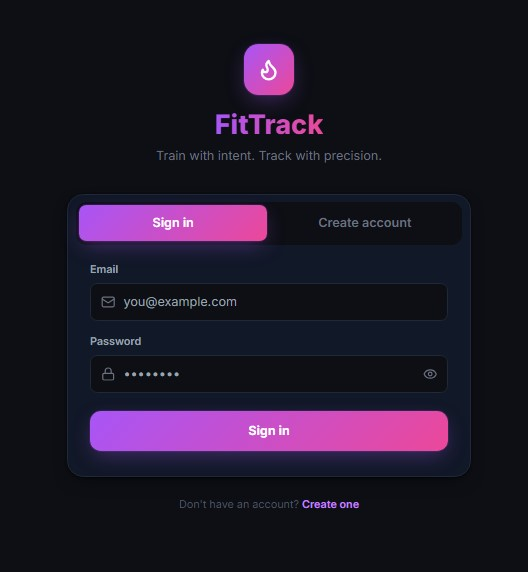
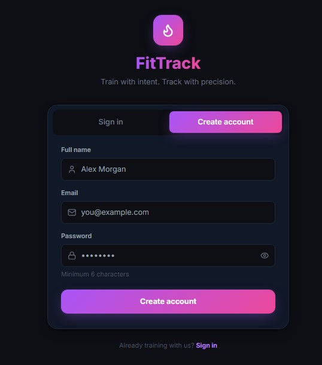
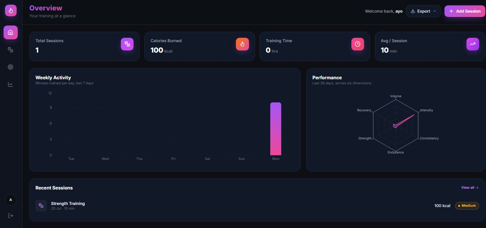
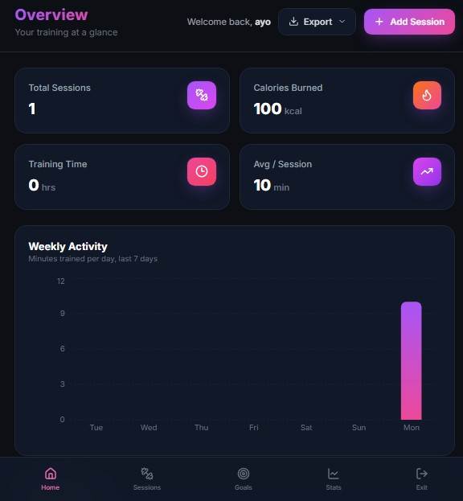
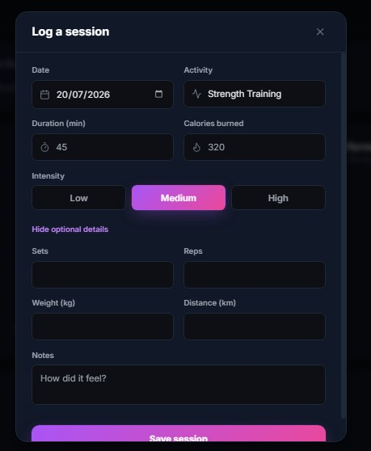
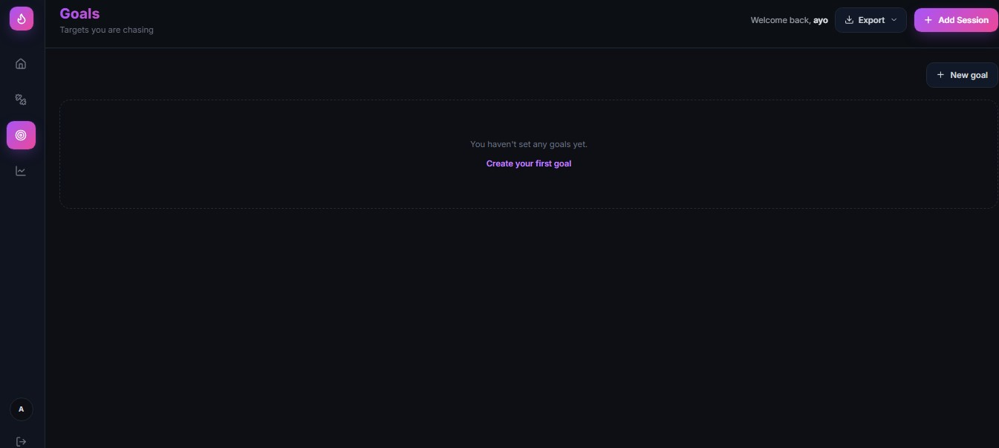
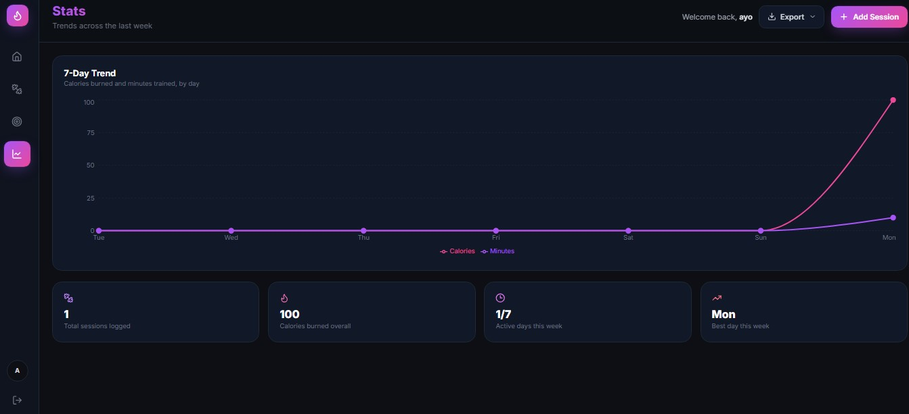
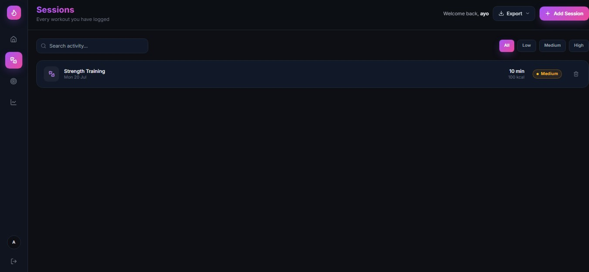

# FitTrack

A full-stack fitness tracker: log workouts, set goals, and see your training trends on a dark, gradient-accented dashboard.

**Stack:** React 18 + Vite + Tailwind + Recharts on the front end, Node/Express + MongoDB + JWT on the back end.

---

## Screenshots

| Login | Home |
|---|---|
|  |    |  |  |  | 

| Add Session | Goals | Stats |
|---|---|---|
|  |  |  | |  


---

## 1. Prerequisites

- Node.js 18+
- A MongoDB database — either a local instance (`mongod`) or a free [MongoDB Atlas](https://www.mongodb.com/atlas) cluster

## 2. Project layout

```
fittrack/
├── server/     Express API (auth, sessions, goals)
└── client/     React + Vite frontend
```

## 3. Backend setup

```bash
cd server
cp .env.example .env    # then edit MONGO_URI and JWT_SECRET
npm install
npm run dev              # nodemon, http://localhost:5000
```

Required `.env` values:

| Variable | Description |
|---|---|
| `PORT` | API port (default `5000`) |
| `MONGO_URI` | MongoDB connection string |
| `JWT_SECRET` | Long random string used to sign tokens |
| `JWT_EXPIRES_IN` | Token lifetime, e.g. `7d` |
| `CLIENT_ORIGIN` | Frontend origin allowed by CORS, e.g. `http://localhost:5173` |

Health check: `GET http://localhost:5000/api/health`

## 4. Frontend setup

```bash
cd client
cp .env.example .env      # VITE_API_URL should point at the API above
npm install
npm run dev                # http://localhost:5173
```

## 5. Using the app

1. Open `http://localhost:5173`, switch to the **Create account** tab, and register.
2. You'll land on the dashboard. Use the **Add Session** button (top right) to log a workout.
3. Use the sidebar (desktop) or bottom bar (mobile) to move between **Home**, **Sessions**, **Goals**, and **Stats**.
4. Set targets on the **Goals** tab and nudge progress with the +/- controls.
5. Export everything you've logged as JSON or CSV from the **Export** menu in the header.

## 6. API reference

All `/api/sessions` and `/api/goals` routes require `Authorization: Bearer <token>`.

| Method | Route | Description |
|---|---|---|
| POST | `/api/auth/register` | Create an account, returns `{ token, user }` |
| POST | `/api/auth/login` | Log in, returns `{ token, user }` |
| GET | `/api/auth/me` | Current user profile |
| GET | `/api/sessions` | List the current user's sessions |
| POST | `/api/sessions` | Log a new session |
| PUT | `/api/sessions/:id` | Update a session |
| DELETE | `/api/sessions/:id` | Delete a session |
| GET | `/api/goals` | List the current user's goals |
| POST | `/api/goals` | Create a goal |
| PUT | `/api/goals/:id` | Update a goal (e.g. bump `current`) |
| DELETE | `/api/goals/:id` | Delete a goal |

## 7. Notes

- Passwords are hashed with bcrypt before they ever touch the database.
- JWTs are stored in `localStorage` on the client and attached automatically via an Axios interceptor; a `401` response clears the session and redirects to `/login`.
- The performance radar chart on the Home tab is derived entirely from your own logged sessions (volume, intensity, consistency, endurance, strength, recovery) — no fake data.
- To build for production: `npm run build` in `client/`, then serve `client/dist` with any static host (or point the Express server at it) and deploy `server/` with `npm start`.


🔗 Live Demo: [https://your-live-link.netlify.app](#)

## 👨‍💻 Author

Atunde Toheeb Ayomide (Jiggy)  
📍 Lagos, Nigeria  
📧 [atundetoheeb1@gmail.com](mailto:atundetoheeb1@gmail.com)  
🔗 [GitHub](https://github.com/ceezign) | [LinkedIn](https://www.linkedin.com/in/atunde-toheeb-551826313)

---

## 🪪 License

This project is open source and available under the MIT License.